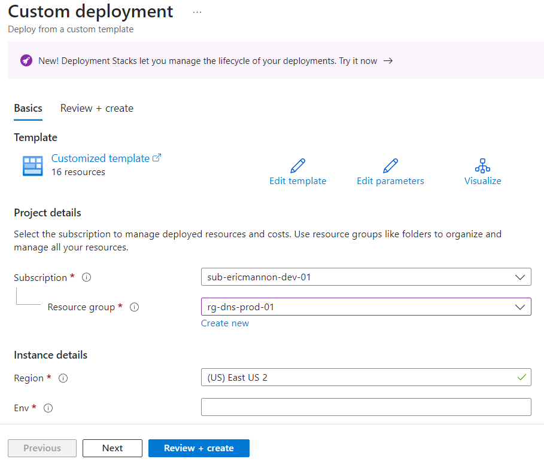
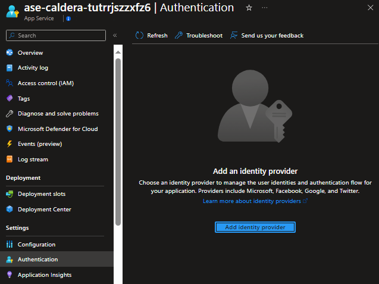
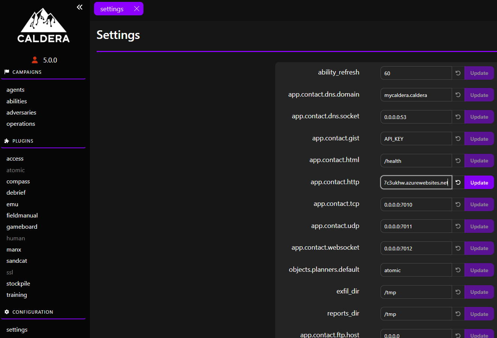

# Azure App Service Caldera Deployment

This project deploys a Caldera server on Azure App Service for Breach and Attack Simulation.

## What is MITRE Caldera?

**MITRE Caldera 5.0** is a cybersecurity platform designed to automate adversary emulation, assist manual red-teams, and automate incident response.

1. **History**:
   - **Caldera** was built on the foundation of **MITRE ATT&CK™**.
   - It serves as a bridge between government, industry, and academia, delivering public interest impact to enhance national and global safety and stability.
   - The framework enables autonomous breach-and-simulation exercises, manual red-team engagements, and automated incident response.

2. **Functionality**:
   - **Autonomous Adversary Emulation**: Cyber teams can create specific threat profiles (adversaries) and launch them in a network to identify vulnerabilities. This aids in testing defenses and training blue teams to detect specific threats.
   - **Test & Evaluation of Detection, Analytic, and Response Platforms**: Automated testing covers network and host defenses, logging, sensors, analytics, and alerting.
   - **Manual Red-Team Engagements**: Caldera augments existing offensive toolsets, assisting red teams in manual assessments.
   - **Purple Teams**: The framework supports cutting-edge research in cyber gaming, emulation, simulation, and cyber defense analytics.

3. **Purpose**:
   - **Resource Efficiency**: Caldera reduces the resources needed for routine security testing, allowing security teams to focus on critical problems.
   - **Intelligent Red-Team System**: It facilitates penetration testing, red teams, and adversary emulation, freeing up security professionals to address other challenges.

Official Website: [MITRE Caldera website](https://caldera.mitre.org/)

Medium Article: [Announcing MITRE Caldera v5](https://medium.com/@mitrecaldera/announcing-mitre-caldera-v5-06798b928adf)

Official Github: [MITRE Caldera](https://github.com/mitre/caldera)

## Overview

This project deploys the following Azure resource types:

- Azure App Service 
- Azure Automation Account (for deploying Caldera Agents)
- Log Analytics Workspace (for logging)
- Storage Account (for scripts)

## Deployment

1. Hit blue "Deploy" button.

2. Specify your Azure Subscription and Resource Group.

   

3. Critical! Set up Authentication with Entra ID. (local users are red/blue with the password "admin")

   

4. Set the Caldera Agents URL.

    

## Programming Notes
-No warranties expressed or implied. If you forget to set up auth and your Caldera server gets used to deliver actual malware evil, that's on you. 

