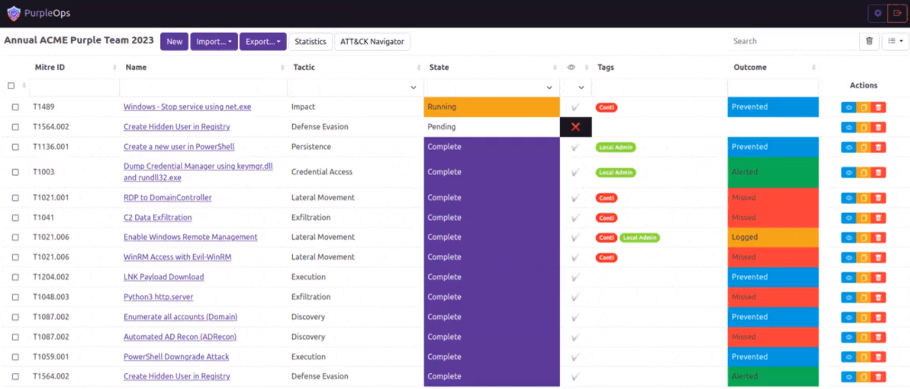

# Azure App Service PurpleOps Deployment

This project deploys a PurpleOps container on Azure App Service for Purple Teaming.

## What is PurpleOps?

**PurpleOps** is a free, open-source web app to track Purple Team assessments. Create assessments aligned with MITRE ATT&CK, leveraging data from sources like Atomic Red Team and SIGMA. Centralise blue and red team data for evaluation. Iterate and improve organisational cybersecurity capabilities.

Boasts a permissive licence, a lean hackable codebase and freedom to import / export data as you please.

   

Key Features:

-Template engagements and testcases

-Framework friendly

-Role-based Access Control & MFA

-Inbuilt DOCX reporting + custom template support

How PurpleOps is different:

-No attribution needed

-Hackable, no “no-reversing” clauses

-No over complications with tomcat, redis, manual database transplanting and an obtuce permission modeltates penetration testing, red teams, and adversary emulation, freeing up security professionals to address other challenges.

PurpleOps Repo: https://github.com/CyberCX-STA/PurpleOps

## Overview

This project deploys the following Azure resource types:

- Azure App Service 
- App Service Plan

## Deployment

1. Hit the blue "Deploy" button below.

2. Specify your Azure Subscription and Resource Group.

   

3. Critical! Set up users & change admin password. (First Local User is admin@purpleops.com & Admin3301049!0!)

## Programming Notes
-No warranties expressed or implied. 

